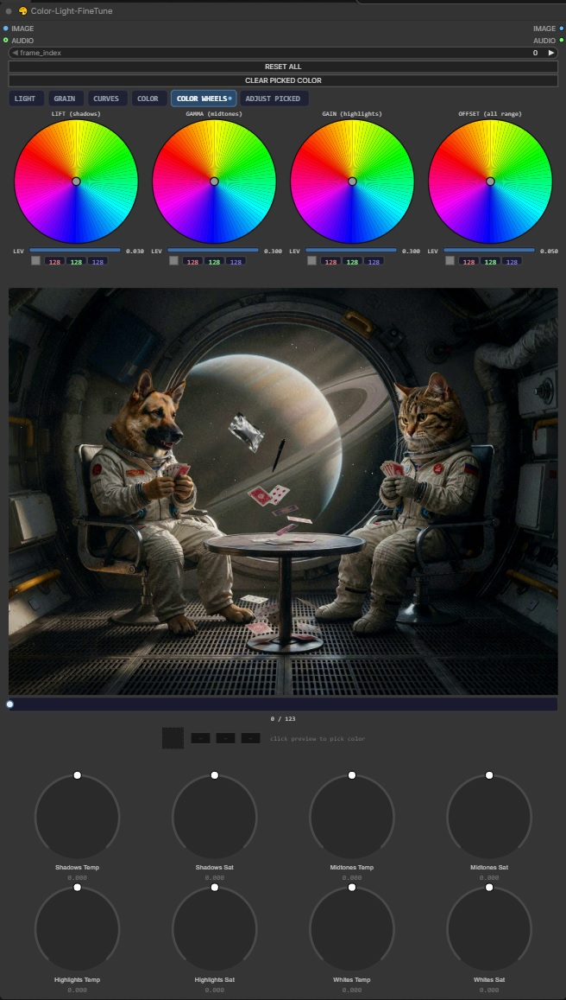

# 🎨 Color-Light-FineTune

ComfyUI 调色与布光节点：内置实时预览、色彩轮、分区色彩平衡、色调曲线、胶片颗粒，以及针对取色（目标颜色）的精细调整。支持图片与视频（帧批次）。

## 功能特性

- **节点内实时预览** — 拖动控件时实时更新，无需 Queue
- **色彩轮** — LIFT（阴影）/ GAMMA（中间调）/ GAIN（高光）/ OFFSET（全范围）：完整色相圆盘、每轮独立的强度（LEV）条、实时 RGB 读数
- **Adjust Picked（取色调整）** — 在预览上点击取色，只调整该颜色：容差 / 色相 / 饱和度 / 亮度；未取色前滑块保持灰色
- **分区色彩平衡** — 阴影 / 中间调 / 高光 / 白点各自的色温 + 饱和度（预览下方 8 个旋钮）
- **影调工具** — Brightness（亮度）、Contrast（对比度）、三点色调曲线、Vibrance（自然饱和度）
- **Highlight Ceiling / Shadow Floor** — 柔和的肩部与趾部：高光向白色弯曲而不硬裁剪，黑点抬升同时保留阴影纹理
- **胶片颗粒** — 内置预设观感，含 Strength / Size / Softness 参数；确定性（同一帧始终得到相同颗粒，无闪烁）
- **视频支持** — 预览下方的帧滑块用于逐帧查看；处理进度每 16 帧报告一次到 ComfyUI 终端（CPU 渲染）

## 安装

1. 将此文件夹复制到 `ComfyUI/custom_nodes/`
2. 重启 ComfyUI

**要求**

- 无需额外安装包 — 仅使用 torch（以及 ComfyUI 已自带的 PIL/aiohttp）

## 使用说明

- 连接图片（或视频 → 帧批次）。AUDIO 为可选的音频直通（用于视频）。
- 所有控件默认中性 → 输出与原图一致（恒等输出）。
- 最终结果照常通过 **Queue** 生成。
- **取色：** 点击预览（十字标记取色点）→ ADJUST PICKED 滑块变为可用。
- **示例工作流：** [图片](examples/Image_Color-Light-FineTune.json) · [视频](examples/Video_Color-Light-FineTune.json)

## 许可证

MIT
